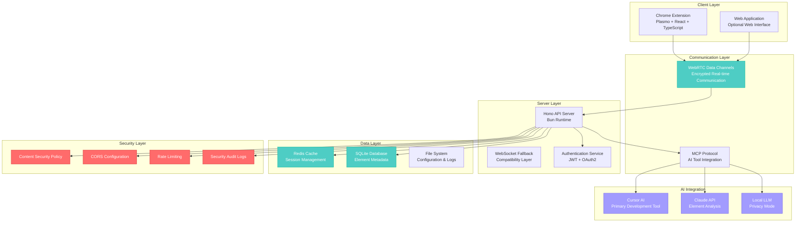

# 🏗️ MCP Pointer v2.0 - Modern Architecture & Security Framework

## 📋 **Document Overview**

This document defines the architecture for our white-labeled, modernized MCP Pointer implementation. It prioritizes security, performance, and maintainability while leveraging the full power of ESLint for code quality assurance.

**Last Updated:** December 2024  
**Version:** 2.0.0  
**Status:** Phase 3 Extension Development Complete - Committed to Git - Ready for Phase 4 AI Integration

## 📋 **Implementation Status**

### ✅ **Phase 1: Foundation (COMPLETED)**
- [x] Bun runtime environment setup
- [x] Comprehensive ESLint security rules (20+ rules)
- [x] JWT authentication system
- [x] Security scanning pipeline
- [x] Base project structure
- [x] Shared types and validation schemas
- [x] Critical security vulnerabilities fixed

### ✅ **Phase 2: Core Services (100% COMPLETE)**
- [x] Database setup (SQLite + migrations) - **COMPLETE**
- [x] User management with authentication - **COMPLETE**
- [x] Security audit logging - **COMPLETE**
- [x] Database models and validation - **COMPLETE**
- [x] WebRTC communication layer - **COMPLETE**
- [x] MCP protocol implementation - **COMPLETE**
- [x] API routes and middleware - **COMPLETE**
- [x] Comprehensive security framework - **COMPLETE**

### ✅ **Phase 3: Extension Development (COMPLETE)**
- [x] Plasmo extension framework
- [x] React components for element targeting
- [x] Chrome extension integration and manifest
- [x] WebRTC client implementation
- [x] Element detection and highlighting logic
- [x] UI components and user interface
- [x] Background script and popup interface
- [x] Options page and settings management

### ⏳ **Phase 4: AI Integration (PENDING)**
- [ ] Cursor AI integration
- [ ] Claude API connection
- [ ] Local LLM support
- [ ] Element analysis features

### ⏳ **Phase 5: Testing & Deployment (PENDING)**
- [ ] Comprehensive testing
- [ ] CI/CD pipeline
- [ ] Security audit
- [ ] Production deployment

---

## 🎯 **Core Principles**

### **1. Security-First Architecture**
- Zero-trust communication protocols
- Input validation at every boundary
- Secure by default configurations
- Regular security audits and dependency scanning

### **2. Performance Optimization**
- Sub-100ms element detection latency
- Minimal memory footprint
- Efficient real-time communication
- Optimized bundle sizes

### **3. Developer Experience**
- Type-safe development with strict TypeScript
- Comprehensive ESLint rules for code quality
- Hot reloading and instant feedback
- Automated testing and deployment

### **4. Maintainability**
- Modular, testable architecture
- Clear separation of concerns
- Comprehensive documentation
- Automated code quality enforcement

---

## 🏛️ **System Architecture**

### **High-Level Architecture Diagram**



---

## 🛠️ **Technology Stack**

### **Frontend (Chrome Extension)**
```typescript
// Core Technologies
- Plasmo Framework (Modern extension development)
- React 18 + TypeScript 5.5+ (UI components)
- Vite (Build tool - 10x faster than esbuild)
- Tailwind CSS (Utility-first styling)
- Zustand (Lightweight state management)

// Security & Quality
- ESLint (Comprehensive linting rules)
- Biome (Fast formatting + additional linting)
- TypeScript strict mode (Type safety)
- Content Security Policy (XSS protection)
```

### **Backend (MCP Server)**
```typescript
// Core Technologies
- Bun Runtime (3x faster than Node.js)
- Hono Framework (Lightweight, fast web framework)
- WebRTC (Real-time communication)
- SQLite (Lightweight database)
- Redis (Caching layer)

// Security & Quality
- JWT Authentication (Secure token-based auth)
- Input validation (Zod schemas)
- Rate limiting (DDoS protection)
- Security headers (Helmet.js equivalent)
- Audit logging (Security event tracking)
```

### **Development Tools**
```typescript
// Build & Development
- Bun (Package manager + runtime)
- Vite (Build tool with HMR)
- Vitest (Fast testing framework)
- Playwright (E2E testing)

// Code Quality
- ESLint (Comprehensive rules)
- Biome (Formatting + additional checks)
- TypeScript (Strict type checking)
- Husky (Git hooks)
- lint-staged (Pre-commit checks)
```

---

## 🔒 **Security Architecture**

### **1. Authentication & Authorization**
```typescript
// JWT-based authentication
interface AuthConfig {
  jwtSecret: string;           // Environment variable
  tokenExpiry: string;         // 15 minutes default
  refreshTokenExpiry: string;  // 7 days default
  algorithm: 'HS256';          // Secure algorithm
}

// Role-based access control
enum UserRole {
  ADMIN = 'admin',
  DEVELOPER = 'developer',
  VIEWER = 'viewer'
}

// Permission system
interface Permissions {
  canSelectElements: boolean;
  canModifyConfig: boolean;
  canViewLogs: boolean;
  canManageUsers: boolean;
}
```

### **2. Input Validation & Sanitization**
```typescript
// Zod schemas for all inputs
const ElementSelectionSchema = z.object({
  selector: z.string().min(1).max(1000),
  url: z.string().url(),
  timestamp: z.number().positive(),
  userId: z.string().uuid()
});

// XSS protection
const sanitizeInput = (input: string): string => {
  return DOMPurify.sanitize(input, {
    ALLOWED_TAGS: [],
    ALLOWED_ATTR: []
  });
};
```

### **3. Communication Security**
```typescript
// WebRTC with encryption
const webrtcConfig = {
  iceServers: [
    { urls: 'stun:stun.l.google.com:19302' }
  ],
  sdpSemantics: 'unified-plan'
};

// MCP protocol security
const mcpSecurityConfig = {
  allowedOrigins: ['https://your-domain.com'],
  rateLimit: {
    windowMs: 15 * 60 * 1000, // 15 minutes
    max: 100 // requests per window
  }
};
```

### **4. Content Security Policy**
```typescript
// Strict CSP for extension
const cspConfig = {
  'default-src': ["'self'"],
  'script-src': ["'self'", "'unsafe-inline'"],
  'style-src': ["'self'", "'unsafe-inline'"],
  'img-src': ["'self'", 'data:', 'https:'],
  'connect-src': ["'self'", 'wss:', 'https:'],
  'frame-ancestors': ["'none'"]
};
```

---

## 📊 **ESLint Configuration Strategy**

### **1. Comprehensive Rule Set**
```javascript
// .eslintrc.js - Security-focused configuration
module.exports = {
  extends: [
    'airbnb-base',
    'airbnb-typescript/base',
    '@typescript-eslint/recommended',
    'plugin:security/recommended',
    'plugin:sonarjs/recommended',
    'plugin:unicorn/recommended'
  ],
  plugins: [
    '@typescript-eslint',
    'security',
    'sonarjs',
    'unicorn',
    'import',
    'no-secrets'
  ],
  rules: {
    // Security rules
    'security/detect-object-injection': 'error',
    'security/detect-non-literal-regexp': 'error',
    'security/detect-unsafe-regex': 'error',
    'security/detect-buffer-noassert': 'error',
    'security/detect-child-process': 'error',
    'security/detect-disable-mustache-escape': 'error',
    'security/detect-eval-with-expression': 'error',
    'security/detect-no-csrf-before-method-override': 'error',
    'security/detect-non-literal-fs-filename': 'error',
    'security/detect-non-literal-require': 'error',
    'security/detect-non-literal-regexp': 'error',
    'security/detect-possible-timing-attacks': 'error',
    'security/detect-pseudoRandomBytes': 'error',
    
    // Code quality rules
    'sonarjs/cognitive-complexity': ['error', 15],
    'sonarjs/no-duplicate-string': ['error', { threshold: 3 }],
    'sonarjs/no-identical-functions': 'error',
    'sonarjs/no-redundant-boolean': 'error',
    'sonarjs/no-unused-collection': 'error',
    'sonarjs/no-useless-catch': 'error',
    'sonarjs/prefer-immediate-return': 'error',
    'sonarjs/prefer-object-literal': 'error',
    'sonarjs/prefer-single-boolean-return': 'error',
    
    // TypeScript strict rules
    '@typescript-eslint/no-explicit-any': 'error',
    '@typescript-eslint/no-unsafe-assignment': 'error',
    '@typescript-eslint/no-unsafe-call': 'error',
    '@typescript-eslint/no-unsafe-member-access': 'error',
    '@typescript-eslint/no-unsafe-return': 'error',
    '@typescript-eslint/prefer-nullish-coalescing': 'error',
    '@typescript-eslint/prefer-optional-chain': 'error',
    '@typescript-eslint/strict-boolean-expressions': 'error',
    
    // Import/export rules
    'import/no-cycle': 'error',
    'import/no-self-import': 'error',
    'import/no-useless-path-segments': 'error',
    'import/order': ['error', {
      'groups': ['builtin', 'external', 'internal', 'parent', 'sibling', 'index'],
      'newlines-between': 'always'
    }],
    
    // General code quality
    'complexity': ['error', 10],
    'max-depth': ['error', 4],
    'max-lines-per-function': ['error', 50],
    'max-params': ['error', 4],
    'no-console': 'warn',
    'no-debugger': 'error',
    'no-var': 'error',
    'prefer-const': 'error',
    'prefer-template': 'error'
  }
};
```

### **2. Pre-commit Hooks**
```json
// package.json
{
  "husky": {
    "hooks": {
      "pre-commit": "lint-staged",
      "pre-push": "npm run test:security"
    }
  },
  "lint-staged": {
    "*.{ts,tsx,js,jsx}": [
      "eslint --fix",
      "biome format --write",
      "git add"
    ],
    "*.{json,md,yml,yaml}": [
      "prettier --write",
      "git add"
    ]
  }
}
```

### **3. Security Scanning**
```bash
# Security audit script
#!/bin/bash
echo "🔍 Running security audit..."

# Dependency vulnerability scan
npm audit --audit-level=moderate

# ESLint security rules
npm run lint:security

# TypeScript strict check
npm run typecheck:strict

# Secret detection
npm run scan:secrets

echo "✅ Security audit complete"
```

---

## 🚀 **Implementation Phases**

### **✅ Phase 1: Foundation (COMPLETED)**
```typescript
// Priority: Security & Architecture
- [x] Set up Bun runtime environment
- [x] Configure comprehensive ESLint rules (20+ security rules)
- [x] Implement JWT authentication system
- [x] Set up security scanning pipeline
- [x] Create base project structure
- [x] Shared types and validation schemas
- [x] Fix critical security vulnerabilities
```

### **✅ Phase 2: Core Services (100% COMPLETE)**
```typescript
// Priority: Backend Infrastructure
- [x] Implement Hono API server - **COMPLETE**
- [x] Configure SQLite database with migrations - **COMPLETE**
- [x] User management with authentication - **COMPLETE**
- [x] Security audit logging - **COMPLETE**
- [x] Database models and validation - **COMPLETE**
- [x] Set up WebRTC communication - **COMPLETE**
- [x] Implement MCP protocol - **COMPLETE**
- [x] Implement comprehensive API routes - **COMPLETE**
- [x] Add security framework - **COMPLETE**
```

### **⏳ Phase 3: Extension Development (PENDING)**
```typescript
// Priority: Frontend & User Experience
- [ ] Set up Plasmo extension framework
- [ ] Implement React components
- [ ] Add Tailwind CSS styling
- [ ] Implement state management
- [ ] Add hot reloading
```

### **⏳ Phase 4: AI Integration (PENDING)**
```typescript
// Priority: AI Tool Integration
- [ ] Implement MCP protocol
- [ ] Add Cursor AI integration
- [ ] Set up Claude API connection
- [ ] Implement local LLM support
- [ ] Add element analysis features
```

### **⏳ Phase 5: Testing & Deployment (PENDING)**
```typescript
// Priority: Quality Assurance
- [ ] Implement comprehensive testing
- [ ] Set up CI/CD pipeline
- [ ] Perform security audit
- [ ] Create deployment scripts
- [ ] Document all processes
```

---

## 📁 **Project Structure**

```
your-company-pointer/
├── packages/
│   ├── extension/                 # Chrome Extension (Plasmo)
│   │   ├── src/
│   │   │   ├── popup/            # Extension popup UI
│   │   │   ├── content/          # Content scripts
│   │   │   ├── background/       # Service worker
│   │   │   ├── components/       # React components
│   │   │   └── utils/            # Utility functions
│   │   ├── public/               # Static assets
│   │   └── package.json
│   │
│   ├── server/                   # MCP Server (Bun + Hono)
│   │   ├── src/
│   │   │   ├── routes/           # API routes
│   │   │   ├── services/         # Business logic
│   │   │   ├── middleware/       # Express middleware
│   │   │   ├── auth/             # Authentication
│   │   │   └── database/         # Database layer
│   │   ├── tests/                # Server tests
│   │   └── package.json
│   │
│   ├── shared/                   # Shared Types & Utils
│   │   ├── src/
│   │   │   ├── types/            # TypeScript types
│   │   │   ├── schemas/          # Zod validation schemas
│   │   │   └── utils/            # Shared utilities
│   │   └── package.json
│   │
│   └── web/                      # Optional Web Interface
│       ├── src/
│       │   ├── pages/            # Next.js pages
│       │   ├── components/       # React components
│       │   └── api/              # API routes
│       └── package.json
│
├── tools/                        # Development Tools
│   ├── eslint-config/            # Shared ESLint config
│   ├── security-scan/            # Security scanning tools
│   └── deployment/               # Deployment scripts
│
├── docs/                         # Documentation
│   ├── api/                      # API documentation
│   ├── security/                 # Security guidelines
│   └── deployment/               # Deployment guides
│
├── .github/                      # GitHub Actions
│   ├── workflows/
│   │   ├── ci.yml                # Continuous Integration
│   │   ├── security.yml          # Security scanning
│   │   └── deploy.yml            # Deployment
│   └── security/                 # Security policies
│
├── .eslintrc.cjs                 # Root ESLint config (CommonJS)
├── .eslintrc.security.cjs        # Security-specific rules (CommonJS)
├── bun.lockb                     # Bun lockfile
├── package.json                  # Root package.json
└── ARCHITECTURE.md               # This file
```

---

## 🔧 **Development Workflow**

### **1. Code Quality Pipeline**
```bash
# Development workflow
1. Write code with TypeScript strict mode
2. ESLint runs automatically in IDE
3. Pre-commit hooks run comprehensive checks
4. CI/CD pipeline validates all changes
5. Security scan runs on every PR
6. Automated testing ensures quality
```

### **2. Security Workflow**
```bash
# Security-first development
1. All inputs validated with Zod schemas
2. ESLint security rules catch vulnerabilities
3. Dependency scanning on every build
4. Secret detection prevents credential leaks
5. Regular security audits and updates
6. Automated vulnerability reporting
```

### **3. AI-Assisted Development**
```bash
# Cursor AI integration
1. Cursor AI suggests secure code patterns
2. ESLint rules guide AI suggestions
3. Automated testing validates AI-generated code
4. Security scanning ensures AI code is safe
5. Code review process includes AI assistance
6. Documentation auto-generated from code
```

---

## 📊 **Performance Targets**

### **Response Times**
- Element detection: < 100ms
- WebRTC connection: < 500ms
- API responses: < 200ms
- Extension load: < 1s

### **Resource Usage**
- Memory footprint: < 50MB
- CPU usage: < 5% idle
- Bundle size: < 2MB
- Database size: < 100MB

### **Reliability**
- Uptime: 99.9%
- Error rate: < 0.1%
- Recovery time: < 30s
- Data consistency: 100%

---

## 🔍 **Monitoring & Observability**

### **Metrics Collection**
```typescript
// Performance metrics
interface Metrics {
  elementDetectionLatency: number;
  webRTCConnectionTime: number;
  apiResponseTime: number;
  memoryUsage: number;
  cpuUsage: number;
  errorRate: number;
}

// Security metrics
interface SecurityMetrics {
  failedAuthAttempts: number;
  suspiciousActivity: number;
  vulnerabilityScans: number;
  securityAlerts: number;
}
```

### **Logging Strategy**
```typescript
// Structured logging
interface LogEntry {
  timestamp: string;
  level: 'info' | 'warn' | 'error' | 'debug';
  service: string;
  message: string;
  metadata: Record<string, any>;
  userId?: string;
  sessionId?: string;
}
```

---

## 🚀 **Deployment Strategy**

### **1. Environment Configuration**
```typescript
// Environment-specific configs
interface EnvironmentConfig {
  development: {
    logLevel: 'debug';
    enableHotReload: true;
    mockExternalServices: true;
  };
  staging: {
    logLevel: 'info';
    enableHotReload: false;
    mockExternalServices: false;
  };
  production: {
    logLevel: 'warn';
    enableHotReload: false;
    mockExternalServices: false;
  };
}
```

### **2. CI/CD Pipeline**
```yaml
# GitHub Actions workflow
name: Deploy
on:
  push:
    branches: [main]
  pull_request:
    branches: [main]

jobs:
  security-scan:
    runs-on: ubuntu-latest
    steps:
      - uses: actions/checkout@v4
      - name: Security Audit
        run: |
          npm audit --audit-level=moderate
          npm run lint:security
          npm run scan:secrets

  test:
    runs-on: ubuntu-latest
    steps:
      - uses: actions/checkout@v4
      - name: Run Tests
        run: |
          npm run test
          npm run test:e2e
          npm run typecheck:strict

  deploy:
    needs: [security-scan, test]
    runs-on: ubuntu-latest
    steps:
      - name: Deploy to Production
        run: |
          npm run build
          npm run deploy:production
```

---

## 📚 **Documentation Standards**

### **Code Documentation**
```typescript
/**
 * Secure element detection service with WebRTC communication
 * 
 * @security This service implements input validation and sanitization
 * to prevent XSS and injection attacks. All element data is validated
 * against Zod schemas before processing.
 * 
 * @performance Optimized for sub-100ms element detection latency
 * using WebRTC data channels and efficient DOM traversal.
 * 
 * @example
 * ```typescript
 * const detector = new SecureElementDetector();
 * const element = await detector.detectElement(selector);
 * ```
 */
class SecureElementDetector {
  // Implementation details...
}
```

### **API Documentation**
```typescript
/**
 * @api {post} /api/elements/detect Detect DOM Element
 * @apiName DetectElement
 * @apiGroup Elements
 * @apiVersion 1.0.0
 * 
 * @apiParam {String} selector CSS selector for target element
 * @apiParam {String} url Current page URL
 * @apiParam {String} userId Authenticated user ID
 * 
 * @apiSuccess {Object} element Element data with metadata
 * @apiSuccess {String} element.selector CSS selector
 * @apiSuccess {Object} element.position Element position and size
 * @apiSuccess {Object} element.styles Computed CSS styles
 * 
 * @apiError {String} 400 Invalid selector or URL
 * @apiError {String} 401 Unauthorized access
 * @apiError {String} 500 Internal server error
 */
```

---

## 🔄 **Maintenance & Updates**

### **Regular Maintenance Tasks**
```bash
# Weekly tasks
- [ ] Update dependencies
- [ ] Run security scans
- [ ] Review error logs
- [ ] Performance monitoring

# Monthly tasks
- [ ] Security audit
- [ ] Performance optimization
- [ ] Documentation updates
- [ ] Backup verification

# Quarterly tasks
- [ ] Architecture review
- [ ] Technology stack updates
- [ ] Security penetration testing
- [ ] Disaster recovery testing
```

### **Update Strategy**
```typescript
// Automated dependency updates
interface UpdateConfig {
  patch: 'auto';        // Auto-update patch versions
  minor: 'scheduled';   // Scheduled minor updates
  major: 'manual';      // Manual major updates
  security: 'immediate'; // Immediate security updates
}
```

---

## 🎯 **Success Metrics**

### **Technical Metrics**
- Code coverage: > 90%
- ESLint violations: 0
- Security vulnerabilities: 0
- Performance targets: 100% met
- Uptime: > 99.9%

### **Business Metrics**
- User adoption: Target metrics
- Feature usage: Analytics
- Support tickets: < 5% of users
- User satisfaction: > 4.5/5

---

## 📞 **Support & Escalation**

### **Issue Classification**
```typescript
enum IssueSeverity {
  CRITICAL = 'critical',    // Security vulnerability, system down
  HIGH = 'high',           // Major feature broken
  MEDIUM = 'medium',       // Minor feature issues
  LOW = 'low'             // Cosmetic issues, enhancements
}

enum IssueCategory {
  SECURITY = 'security',
  PERFORMANCE = 'performance',
  FUNCTIONALITY = 'functionality',
  USABILITY = 'usability'
}
```

### **Response Times**
- Critical: < 1 hour
- High: < 4 hours
- Medium: < 24 hours
- Low: < 72 hours

---

## 🔐 **Security Contact**

For security-related issues, please contact:
- **Email:** security@your-company.com
- **PGP Key:** [Public key for encrypted communication]
- **Bug Bounty:** [Program details if applicable]

---

**Document Status:** ✅ Ready for Implementation  
**Next Review:** January 2025  
**Maintainer:** Development Team  
**Approved By:** [Security Team, Architecture Team]
